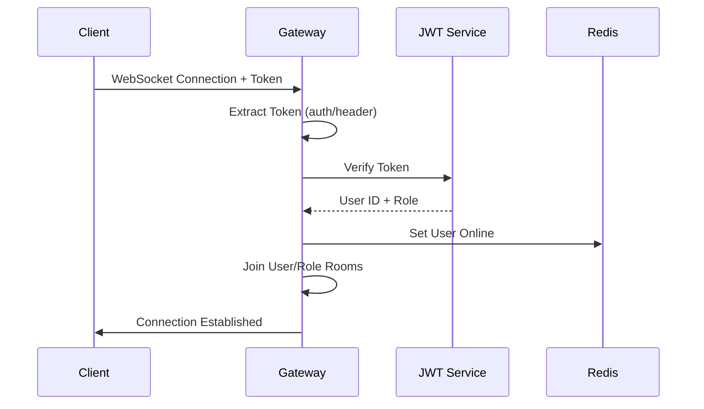

# Notification Gateway Documentation

## 📚 Overview: `notifications.gateway.ts` - WebSocket Gateway

### 🌐 What is a WebSocket Gateway?

A **WebSocket Gateway** handles real-time, bidirectional communication between clients and server. Unlike HTTP requests, WebSockets maintain persistent connections for instant messaging.

---

## 🏗️ Architecture Overview

### **Gateway Configuration (Lines 39-45)**
```typescript
@WebSocketGateway({
  cors: { origin: process.env.WEBSOCKET_CORS_ORIGIN?.split(',') || '*', credentials: true },
  namespace: '/notifications',
})
```

**Key Settings:**
- **Namespace:** `/notifications` - Isolated WebSocket channel
- **CORS:** Allows cross-origin connections from your frontend
- **Credentials:** Enables authentication cookies/tokens

---

## 🔐 Authentication & Connection Flow

### **1. Connection Handler (Lines 61-99)**



**Process:**
1. **Token Extraction** (Lines 63-64)
   - Gets token from `client.handshake.auth.token` or `Authorization` header
   - Supports both auth object and header methods

2. **JWT Verification** (Lines 72-75)
   - Validates token authenticity
   - Extracts `userId` (`sub`) and `userType` (`role`)

3. **User Registration** (Lines 77-84)
   - Stores user info in `client.data`
   - Marks user as online in Redis
   - Joins specific rooms for targeted messaging

4. **Connection Confirmation** (Lines 90-93)
   - Sends success response to client

### **2. Disconnection Handler (Lines 101-108)**
```typescript
async handleDisconnect(client: Socket)
```
- **Cleanup:** Removes user from online status in Redis
- **Logging:** Tracks disconnection for monitoring

---

## 📨 Message Handlers

### **1. Notification Read Handler (Lines 110-121)**
```typescript
@SubscribeMessage('notification:read')
handleNotificationRead(@MessageBody() data: NotificationData)
```

**Purpose:** Marks notifications as read
- **Client sends:** `{ notificationId: number }`
- **Server responds:** `{ success: true }`
- **Use case:** Update UI when user reads notification

### **2. FCM Token Registration (Lines 123-133)**
```typescript
@SubscribeMessage('fcm:register')
handleFcmTokenRegistration(@MessageBody() data: FcmTokenData)
```

**Purpose:** Registers push notification tokens
- **Client sends:** `{ token: string, platform: string }`
- **Server stores:** Token in Redis for push notifications
- **Use case:** Enable FCM push notifications when app is background

### **3. Location Updates (Lines 135-153)**
```typescript
@SubscribeMessage('location:update')
handleLocationUpdate(@MessageBody() data: LocationData)
```

**Purpose:** Real-time driver tracking
- **Client sends:** `{ latitude: number, longitude: number }`
- **Server broadcasts:** To tracking room if user is driver
- **Use case:** Live order tracking for customers

---

## 📤 Broadcasting Methods

### **Targeted Messaging (Lines 155-169)**

| Method | Target | Use Case |
|--------|--------|----------|
| `sendToUser()` | Specific user room | Personal notifications |
| `sendToAllDrivers()` | All drivers | Driver announcements |
| `sendToAllCustomers()` | All customers | Customer promotions |
| `broadcast()` | All connected users | System-wide alerts |

**Room Strategy:**
- `user:${userId}` - Individual user messages
- `drivers` - All drivers
- `customers` - All customers
- `tracking:driver:${userId}` - Driver location tracking

---

## 🔄 Redis Integration

### **Channel Subscriptions (Lines 171-183)**
```typescript
private subscribeToRedisChannels()
```

**Purpose:** Cross-server communication
- **Redis Pub/Sub:** Enables multiple server instances to communicate
- **Channels:**
  - `notifications:broadcast` → `broadcast()`
  - `notifications:drivers` → `sendToAllDrivers()`
  - `notifications:customers` → `sendToAllCustomers()`

**Benefit:** Works in distributed environments with multiple app instances

---

## 💡 Real-World Use Cases

### **Delivery App Scenarios:**

| Scenario | Gateway Action |
|----------|----------------|
| **New Order** | `sendToDriver(driverId, 'order:new', orderData)` |
| **Order Status Update** | `sendToCustomer(customerId, 'order:status', statusData)` |
| **Driver Location** | `to('tracking:driver:123').emit('location', coords)` |
| **System Alert** | `broadcast('system:maintenance', alertData)` |

### **Message Flow Examples:**

1. **Order Assignment:**
   ```
   Backend → Redis: 'notifications:drivers' → Gateway → All Drivers
   ```

2. **Personal Notification:**
   ```
   Backend → Gateway.sendToUser() → Specific User Room → Client
   ```

3. **Location Tracking:**
   ```
   Driver App → Gateway → Tracking Room → Customer App
   ```

---

## 🎯 Key Benefits

### **Advantages:**
1. **Real-time:** Instant message delivery
2. **Scalable:** Room-based targeting
3. **Reliable:** Redis pub/sub for distributed systems
4. **Secure:** JWT authentication required
5. **Flexible:** Multiple message types and targets

### **Performance Features:**
- **Connection pooling** via rooms
- **Message filtering** by user type
- **Offline fallback** via FCM tokens
- **Cross-server sync** via Redis

This gateway provides the **real-time backbone** for your delivery app, enabling instant communication between drivers, customers, and the backend system! 🚀
