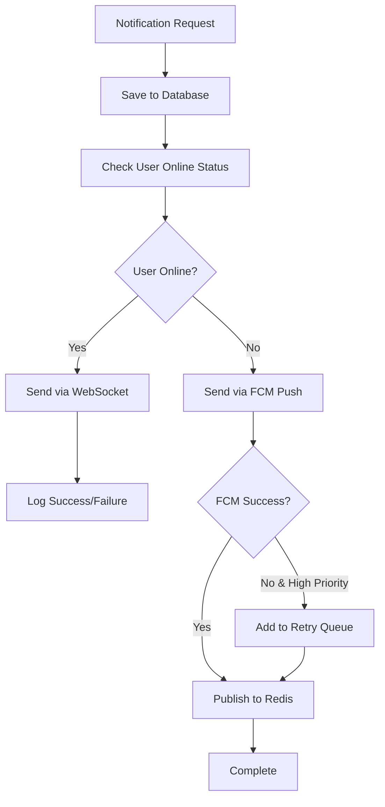

# Notification Service Documentation

## 📚 Overview: `notifications.service.ts` - Core Notification Service

### 🎯 Purpose Overview

The **NotificationsService** is the **central orchestrator** for all notification operations in your delivery app. It manages the complete notification lifecycle from creation to delivery across multiple channels.

---

## 🏗️ Architecture & Dependencies

### **Service Dependencies (Lines 18-23)**
```typescript
constructor(
  private readonly prisma: PrismaService,        // Database operations
  private readonly redisService: RedisService,   // Online status & caching
  private readonly firebaseService: FirebaseService, // Push notifications
  @InjectQueue('notifications') private notificationQueue: Queue, // Background jobs
) {}
```

### **Gateway Integration (Lines 25-27)**
```typescript
setGateway(gateway: NotificationsGateway) {
  this.gateway = gateway;
}
```
- **Circular dependency resolution** between service and gateway
- Gateway is set after initialization to avoid injection issues

---

## 🔄 Core Notification Flow

### **Main Method: `sendNotification()` (Lines 29-97)**



### **Step-by-Step Process:**

#### **1. Database Persistence (Lines 34-43)**
```typescript
const notification = await this.prisma.notification.create({
  data: {
    userId, type, title, message,
    data: data ? JSON.stringify(data) : null,
    isRead: false,
  },
});
```
- **Stores notification permanently** in database
- **JSON serialization** for complex data objects
- **Read status tracking** for UI management

#### **2. Online Status Check (Line 45)**
```typescript
const isOnline = await this.redisService.isUserOnline(userId);
```
- **Redis-based user presence** detection
- **Determines delivery channel** (WebSocket vs Push)

#### **3. Real-time Delivery (Lines 47-64)**
```typescript
if (isOnline && this.gateway) {
  this.gateway.sendToUser(userId, 'notification:new', {
    id, type, title, message, data, timestamp: notification.createdAt,
  });
}
```
- **Instant delivery** via WebSocket if user is online
- **Error handling** for connection issues

#### **4. Push Notification Fallback (Lines 66-74)**
```typescript
const fcmSent = await this.firebaseService.sendToUser(userId, {
  title, body: message,
  data: { notificationId: notification.id.toString(), type, ...data },
});
```
- **Firebase Cloud Messaging** for offline users
- **Includes notification ID** for tracking

#### **5. Retry Logic (Lines 76-88)**
```typescript
if (!isOnline && !fcmSent && priority === 'high') {
  await this.notificationQueue.add('retry-notification', {
    notificationId: notification.id, payload
  }, { attempts: 3, backoff: { type: 'exponential', delay: 2000 } });
}
```
- **High-priority notifications** get retry mechanism
- **Exponential backoff** prevents spam
- **3 attempts maximum** before giving up

#### **6. Cross-Server Sync (Lines 90-96)**
```typescript
await this.redisService.publish(`notifications:user:${userId}`, {
  id, type, title, message, data,
});
```
- **Redis pub/sub** for multi-server environments
- **Ensures consistency** across app instances

---

## 📦 Specialized Methods

### **1. Batch Notifications (Lines 99-118)**
```typescript
async sendBatchNotification(userIds: number[], notification: {...})
```
- **Bulk delivery** to multiple users
- **Promise.allSettled()** ensures partial failures don't stop all
- **Use case:** System announcements, promotions

### **2. Driver Order Assignment (Lines 120-140)**
```typescript
async notifyDriverOfNewOrder(driverId, driverUserId, orderId, distanceMeters)
```
- **Business-specific** notification for drivers
- **Distance calculation** and formatting
- **High priority** with order metadata

### **3. Customer Order Updates (Lines 142-166)**
```typescript
async notifyCustomerOrderStatus(customerId, orderId, status)
```
- **Status-based messaging** with predefined templates
- **Order lifecycle** notifications
- **High priority** for critical updates

### **4. Driver Broadcasting (Lines 168-187)**
```typescript
async broadcastToDrivers(title, message, data?)
```
- **One-to-many** communication with all drivers
- **WebSocket + FCM** for maximum reach
- **Use case:** System alerts, promotions

---

## 📊 Data Management Methods

### **1. Queued Notifications (Lines 189-203)**
```typescript
async getQueuedNotifications(userId: number)
```
- **Fetches unread notifications** from last 24 hours
- **Limited to 50** for performance
- **Ordered by newest first**

### **2. Mark as Read (Lines 205-216)**
```typescript
async markAsRead(notificationId: number, userId: number)
```
- **Updates read status** and timestamp
- **Security check:** ensures user owns the notification

### **3. Paginated History (Lines 218-237)**
```typescript
async getUserNotifications(userId: number, page = 1, limit = 20)
```
- **Pagination support** for mobile apps
- **Metadata included:** total, page, totalPages
- **Performance optimized** with skip/take

---

## 🎯 Business Logic Features

### **Priority System:**
- **High Priority:** Order assignments, status updates (gets retry)
- **Normal Priority:** General notifications, promotions

### **Multi-Channel Strategy:**
1. **WebSocket** (instant, online users)
2. **FCM Push** (offline users)
3. **Retry Queue** (failed high-priority)
4. **Database** (permanent record)

### **Error Resilience:**
- **Graceful degradation** (WebSocket fails → FCM)
- **Retry mechanisms** for critical notifications
- **Logging** for monitoring and debugging

---

## 💡 Real-World Usage Examples

### **Order Flow:**
```typescript
// New order created
await this.notifyDriverOfNewOrder(driverId, driverUserId, orderId, distance);

// Driver accepts order
await this.notifyCustomerOrderStatus(customerId, orderId, 'accepted');

// Order picked up
await this.notifyCustomerOrderStatus(customerId, orderId, 'picked_up');
```

### **System Announcements:**
```typescript
// Broadcast to all drivers
await this.broadcastToDrivers(
  'System Maintenance',
  'App will be down for maintenance in 30 minutes',
  { scheduledTime: '2024-01-01T02:00:00Z' }
);
```

---

## 🚀 Key Benefits

### **Advantages:**
1. **Reliable Delivery:** Multi-channel approach with fallbacks
2. **Scalable:** Handles thousands of notifications efficiently
3. **Flexible:** Supports different priorities and types
4. **Persistent:** Database storage with history
5. **Real-time:** WebSocket for instant delivery
6. **Offline Support:** FCM push notifications
7. **Monitoring:** Comprehensive logging and tracking

This service is the **heart of your notification system**, ensuring that customers and drivers always receive critical updates through the most appropriate channel! 🎯
