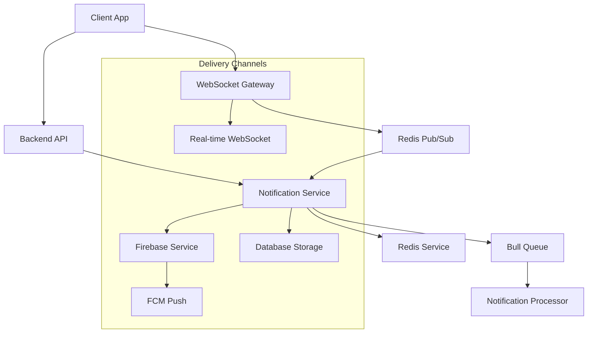

# Notification System Documentation

## 📚 Overview

This directory contains comprehensive documentation for the notification system components in your delivery application.

## 📁 Documentation Files

### 🔄 [Notification Processor](./NOTIFICATION_PROCESSOR.md)
- **Purpose:** Background job processing with Bull queues
- **Key Features:** Retry mechanisms, scheduled notifications, error handling
- **Components:** `@Processor()`, `@Process()` decorators, Redis queue management

### 🌐 [Notification Gateway](./NOTIFICATION_GATEWAY.md)
- **Purpose:** Real-time WebSocket communication
- **Key Features:** Authentication, room management, message broadcasting
- **Components:** WebSocket decorators, JWT verification, Redis pub/sub

### 🎯 [Notification Service](./NOTIFICATION_SERVICE.md)
- **Purpose:** Central notification orchestration
- **Key Features:** Multi-channel delivery, database persistence, retry logic
- **Components:** Service dependencies, specialized methods, data management

---

## 🏗️ System Architecture

---

## 🔄 Notification Flow

1. **Request:** API endpoint calls `NotificationsService.sendNotification()`
2. **Persistence:** Notification saved to database
3. **Detection:** Check user online status via Redis
4. **Delivery:** 
   - If online → WebSocket (instant)
   - If offline → FCM Push (fallback)
5. **Retry:** Failed high-priority notifications go to Bull queue
6. **Sync:** Redis pub/sub ensures cross-server consistency

---

## 🎯 Key Components

| Component | Role | Technology |
|-----------|------|------------|
| **Gateway** | Real-time communication | Socket.IO, WebSocket |
| **Service** | Business logic & orchestration | NestJS, Prisma |
| **Processor** | Background job handling | Bull, Redis |
| **Firebase** | Push notifications | FCM, Firebase Admin |
| **Redis** | Caching & pub/sub | Redis, ioredis |

---

## 💡 Use Cases

### **Delivery App Scenarios:**
- **Order Assignment:** Driver notifications with retry logic
- **Status Updates:** Real-time customer notifications
- **Location Tracking:** Live driver position updates
- **System Alerts:** Broadcast messages to all users

### **Technical Features:**
- **Multi-channel delivery** (WebSocket + FCM + Database)
- **Automatic retry** for failed notifications
- **Real-time presence** detection
- **Cross-server synchronization**
- **Paginated notification history**

---

## 🚀 Benefits

- **Reliability:** Multiple delivery channels with fallbacks
- **Scalability:** Background processing and queue management
- **Real-time:** Instant WebSocket communication
- **Offline Support:** FCM push notifications
- **Monitoring:** Comprehensive logging and error handling
- **Performance:** Optimized database queries and caching

This notification system ensures **reliable, scalable, and efficient** communication between all parts of your delivery application! 🎯
